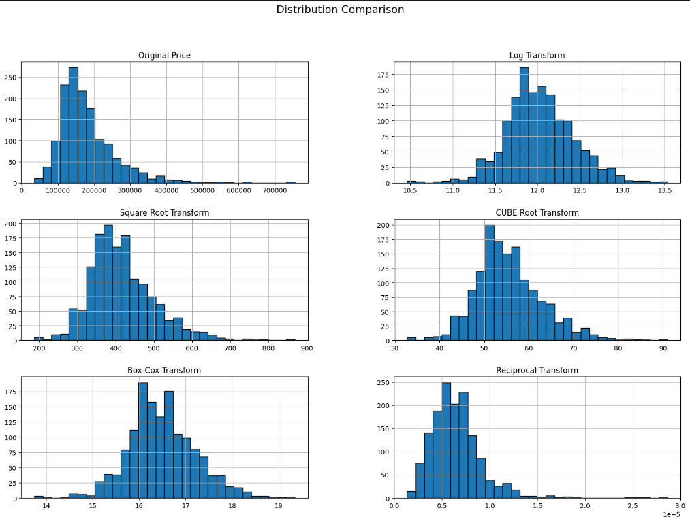
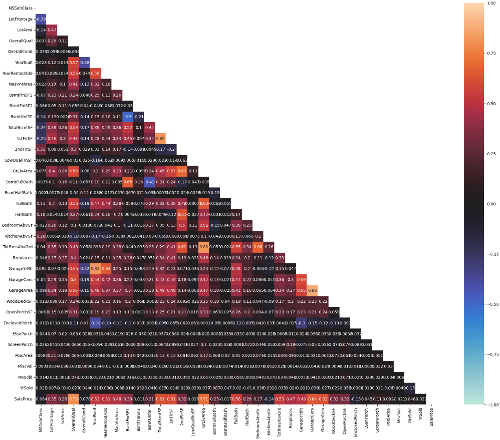

# House Prices - Advanced Regression Techniques
С помощью 79 объясняющих переменных, описывающих (почти) каждый аспект жилых домов в Эймсе, штат Айова, в этом конкурсе предстоит предсказать окончательную цену каждого дома. Предсказание цен опробована с несколькоми разными моделями регрессии, с разными методами предобработок, с разными параметрами моделей и тд

## Содержание 
- [Технологии](#технологии)
- [Использование](#использование)
- [Разработка](#разработка)
- [Сабмит в каггл ](#СабмитВКаггл)
- [О соревновании/проекте/коде и тд и тп](#Final)


## Технологии
- [VScode]
- [Python]
- [Jupyter]

## Использование
Для запуска проекта выберите методы предобработок и трансформации
```python
 imputer_strategy=None, scaler=None, cat_imputer_strategy=None
 transform=None
```
Если не хотите обучать все модельки которые есть в этом коде, то в файле MyTrain.py вы можете убрать ненужные модели.
И после смело можете запустить


## Разработка

### Требования
Для установки и запуска проекта, необходим [Python 3.9.18]

### Установка библиотек 
Для установки библиотек, выполните команду:
```python
 pip install requirements.txt
```
И далее не забудьте создать виртуальное окружение


## Сабмит в каггл 
Для сабмита и получения результатов ваших предсказаний выполните эти команды
```python
 make submit FILES="ваш_файл.csv" COMMENT="твой_комментарий"
```
```python
 make submissions
```
Важно, чтобы отправить свои сабмиты и в целом использовать аpi, получите токен.


### Зачем я разработал этот проект?
Чтобы улучшить свои навыки в мл

## О соревновании/проекте/коде и тд и тп
Предсказание цен на дома. Имеются 79 признаков, целевая переменная SalePrice.
Здесь будут использованы различные модели, методы предобработок, транформации скошенности и тд и тп, по ходу дела показывается.
Метрика оценивания нашей модельки RMSE.

Давайтека взглянем на наш датасет
```python
$ all_data.head(10) 
```
<div>

<table border="1" class="dataframe">
  <thead>
    <tr style="text-align: right;">
      <th></th>
      <th>MSSubClass</th>
      <th>MSZoning</th>
      <th>LotFrontage</th>
      <th>LotArea</th>
      <th>Street</th>
      <th>Alley</th>
      <th>LotShape</th>
      <th>LandContour</th>
      <th>Utilities</th>
      <th>LotConfig</th>
      <th>LandSlope</th>
      <th>Neighborhood</th>
      <th>Condition1</th>
      <th>Condition2</th>
      <th>BldgType</th>
      <th>HouseStyle</th>
      <th>OverallQual</th>
      <th>OverallCond</th>
      <th>YearBuilt</th>
      <th>YearRemodAdd</th>
      <th>RoofStyle</th>
      <th>RoofMatl</th>
      <th>Exterior1st</th>
      <th>Exterior2nd</th>
      <th>MasVnrType</th>
      <th>MasVnrArea</th>
      <th>ExterQual</th>
      <th>ExterCond</th>
      <th>Foundation</th>
      <th>BsmtQual</th>
      <th>BsmtCond</th>
      <th>BsmtExposure</th>
      <th>BsmtFinType1</th>
      <th>BsmtFinSF1</th>
      <th>BsmtFinType2</th>
      <th>BsmtFinSF2</th>
      <th>BsmtUnfSF</th>
      <th>TotalBsmtSF</th>
      <th>Heating</th>
      <th>HeatingQC</th>
      <th>CentralAir</th>
      <th>Electrical</th>
      <th>1stFlrSF</th>
      <th>2ndFlrSF</th>
      <th>LowQualFinSF</th>
      <th>GrLivArea</th>
      <th>BsmtFullBath</th>
      <th>BsmtHalfBath</th>
      <th>FullBath</th>
      <th>HalfBath</th>
      <th>BedroomAbvGr</th>
      <th>KitchenAbvGr</th>
      <th>KitchenQual</th>
      <th>TotRmsAbvGrd</th>
      <th>Functional</th>
      <th>Fireplaces</th>
      <th>FireplaceQu</th>
      <th>GarageType</th>
      <th>GarageYrBlt</th>
      <th>GarageFinish</th>
      <th>GarageCars</th>
      <th>GarageArea</th>
      <th>GarageQual</th>
      <th>GarageCond</th>
      <th>PavedDrive</th>
      <th>WoodDeckSF</th>
      <th>OpenPorchSF</th>
      <th>EnclosedPorch</th>
      <th>3SsnPorch</th>
      <th>ScreenPorch</th>
      <th>PoolArea</th>
      <th>PoolQC</th>
      <th>Fence</th>
      <th>MiscFeature</th>
      <th>MiscVal</th>
      <th>MoSold</th>
      <th>YrSold</th>
      <th>SaleType</th>
      <th>SaleCondition</th>
    </tr>
  </thead>
  <tbody>
    <tr>
      <th>0</th>
      <td>60</td>
      <td>RL</td>
      <td>65.0</td>
      <td>8450</td>
      <td>Pave</td>
      <td>NaN</td>
      <td>Reg</td>
      <td>Lvl</td>
      <td>AllPub</td>
      <td>Inside</td>
      <td>Gtl</td>
      <td>CollgCr</td>
      <td>Norm</td>
      <td>Norm</td>
      <td>1Fam</td>
      <td>2Story</td>
      <td>7</td>
      <td>5</td>
      <td>2003</td>
      <td>2003</td>
      <td>Gable</td>
      <td>CompShg</td>
      <td>VinylSd</td>
      <td>VinylSd</td>
      <td>BrkFace</td>
      <td>196.0</td>
      <td>Gd</td>
      <td>TA</td>
      <td>PConc</td>
      <td>Gd</td>
      <td>TA</td>
      <td>No</td>
      <td>GLQ</td>
      <td>706.0</td>
      <td>Unf</td>
      <td>0.0</td>
      <td>150.0</td>
      <td>856.0</td>
      <td>GasA</td>
      <td>Ex</td>
      <td>Y</td>
      <td>SBrkr</td>
      <td>856</td>
      <td>854</td>
      <td>0</td>
      <td>1710</td>
      <td>1.0</td>
      <td>0.0</td>
      <td>2</td>
      <td>1</td>
      <td>3</td>
      <td>1</td>
      <td>Gd</td>
      <td>8</td>
      <td>Typ</td>
      <td>0</td>
      <td>NaN</td>
      <td>Attchd</td>
      <td>2003.0</td>
      <td>RFn</td>
      <td>2.0</td>
      <td>548.0</td>
      <td>TA</td>
      <td>TA</td>
      <td>Y</td>
      <td>0</td>
      <td>61</td>
      <td>0</td>
      <td>0</td>
      <td>0</td>
      <td>0</td>
      <td>NaN</td>
      <td>NaN</td>
      <td>NaN</td>
      <td>0</td>
      <td>2</td>
      <td>2008</td>
      <td>WD</td>
      <td>Normal</td>
    </tr>
    <tr>
      <th>1</th>
      <td>20</td>
      <td>RL</td>
      <td>80.0</td>
      <td>9600</td>
      <td>Pave</td>
      <td>NaN</td>
      <td>Reg</td>
      <td>Lvl</td>
      <td>AllPub</td>
      <td>FR2</td>
      <td>Gtl</td>
      <td>Veenker</td>
      <td>Feedr</td>
      <td>Norm</td>
      <td>1Fam</td>
      <td>1Story</td>
      <td>6</td>
      <td>8</td>
      <td>1976</td>
      <td>1976</td>
      <td>Gable</td>
      <td>CompShg</td>
      <td>MetalSd</td>
      <td>MetalSd</td>
      <td>NaN</td>
      <td>0.0</td>
      <td>TA</td>
      <td>TA</td>
      <td>CBlock</td>
      <td>Gd</td>
      <td>TA</td>
      <td>Gd</td>
      <td>ALQ</td>
      <td>978.0</td>
      <td>Unf</td>
      <td>0.0</td>
      <td>284.0</td>
      <td>1262.0</td>
      <td>GasA</td>
      <td>Ex</td>
      <td>Y</td>
      <td>SBrkr</td>
      <td>1262</td>
      <td>0</td>
      <td>0</td>
      <td>1262</td>
      <td>0.0</td>
      <td>1.0</td>
      <td>2</td>
      <td>0</td>
      <td>3</td>
      <td>1</td>
      <td>TA</td>
      <td>6</td>
      <td>Typ</td>
      <td>1</td>
      <td>TA</td>
      <td>Attchd</td>
      <td>1976.0</td>
      <td>RFn</td>
      <td>2.0</td>
      <td>460.0</td>
      <td>TA</td>
      <td>TA</td>
      <td>Y</td>
      <td>298</td>
      <td>0</td>
      <td>0</td>
      <td>0</td>
      <td>0</td>
      <td>0</td>
      <td>NaN</td>
      <td>NaN</td>
      <td>NaN</td>
      <td>0</td>
      <td>5</td>
      <td>2007</td>
      <td>WD</td>
      <td>Normal</td>
    </tr>
    <tr>
      <th>2</th>
      <td>60</td>
      <td>RL</td>
      <td>68.0</td>
      <td>11250</td>
      <td>Pave</td>
      <td>NaN</td>
      <td>IR1</td>
      <td>Lvl</td>
      <td>AllPub</td>
      <td>Inside</td>
      <td>Gtl</td>
      <td>CollgCr</td>
      <td>Norm</td>
      <td>Norm</td>
      <td>1Fam</td>
      <td>2Story</td>
      <td>7</td>
      <td>5</td>
      <td>2001</td>
      <td>2002</td>
      <td>Gable</td>
      <td>CompShg</td>
      <td>VinylSd</td>
      <td>VinylSd</td>
      <td>BrkFace</td>
      <td>162.0</td>
      <td>Gd</td>
      <td>TA</td>
      <td>PConc</td>
      <td>Gd</td>
      <td>TA</td>
      <td>Mn</td>
      <td>GLQ</td>
      <td>486.0</td>
      <td>Unf</td>
      <td>0.0</td>
      <td>434.0</td>
      <td>920.0</td>
      <td>GasA</td>
      <td>Ex</td>
      <td>Y</td>
      <td>SBrkr</td>
      <td>920</td>
      <td>866</td>
      <td>0</td>
      <td>1786</td>
      <td>1.0</td>
      <td>0.0</td>
      <td>2</td>
      <td>1</td>
      <td>3</td>
      <td>1</td>
      <td>Gd</td>
      <td>6</td>
      <td>Typ</td>
      <td>1</td>
      <td>TA</td>
      <td>Attchd</td>
      <td>2001.0</td>
      <td>RFn</td>
      <td>2.0</td>
      <td>608.0</td>
      <td>TA</td>
      <td>TA</td>
      <td>Y</td>
      <td>0</td>
      <td>42</td>
      <td>0</td>
      <td>0</td>
      <td>0</td>
      <td>0</td>
      <td>NaN</td>
      <td>NaN</td>
      <td>NaN</td>
      <td>0</td>
      <td>9</td>
      <td>2008</td>
      <td>WD</td>
      <td>Normal</td>
    </tr>
    <tr>
      <th>3</th>
      <td>70</td>
      <td>RL</td>
      <td>60.0</td>
      <td>9550</td>
      <td>Pave</td>
      <td>NaN</td>
      <td>IR1</td>
      <td>Lvl</td>
      <td>AllPub</td>
      <td>Corner</td>
      <td>Gtl</td>
      <td>Crawfor</td>
      <td>Norm</td>
      <td>Norm</td>
      <td>1Fam</td>
      <td>2Story</td>
      <td>7</td>
      <td>5</td>
      <td>1915</td>
      <td>1970</td>
      <td>Gable</td>
      <td>CompShg</td>
      <td>Wd Sdng</td>
      <td>Wd Shng</td>
      <td>NaN</td>
      <td>0.0</td>
      <td>TA</td>
      <td>TA</td>
      <td>BrkTil</td>
      <td>TA</td>
      <td>Gd</td>
      <td>No</td>
      <td>ALQ</td>
      <td>216.0</td>
      <td>Unf</td>
      <td>0.0</td>
      <td>540.0</td>
      <td>756.0</td>
      <td>GasA</td>
      <td>Gd</td>
      <td>Y</td>
      <td>SBrkr</td>
      <td>961</td>
      <td>756</td>
      <td>0</td>
      <td>1717</td>
      <td>1.0</td>
      <td>0.0</td>
      <td>1</td>
      <td>0</td>
      <td>3</td>
      <td>1</td>
      <td>Gd</td>
      <td>7</td>
      <td>Typ</td>
      <td>1</td>
      <td>Gd</td>
      <td>Detchd</td>
      <td>1998.0</td>
      <td>Unf</td>
      <td>3.0</td>
      <td>642.0</td>
      <td>TA</td>
      <td>TA</td>
      <td>Y</td>
      <td>0</td>
      <td>35</td>
      <td>272</td>
      <td>0</td>
      <td>0</td>
      <td>0</td>
      <td>NaN</td>
      <td>NaN</td>
      <td>NaN</td>
      <td>0</td>
      <td>2</td>
      <td>2006</td>
      <td>WD</td>
      <td>Abnorml</td>
    </tr>
    <tr>
      <th>4</th>
      <td>60</td>
      <td>RL</td>
      <td>84.0</td>
      <td>14260</td>
      <td>Pave</td>
      <td>NaN</td>
      <td>IR1</td>
      <td>Lvl</td>
      <td>AllPub</td>
      <td>FR2</td>
      <td>Gtl</td>
      <td>NoRidge</td>
      <td>Norm</td>
      <td>Norm</td>
      <td>1Fam</td>
      <td>2Story</td>
      <td>8</td>
      <td>5</td>
      <td>2000</td>
      <td>2000</td>
      <td>Gable</td>
      <td>CompShg</td>
      <td>VinylSd</td>
      <td>VinylSd</td>
      <td>BrkFace</td>
      <td>350.0</td>
      <td>Gd</td>
      <td>TA</td>
      <td>PConc</td>
      <td>Gd</td>
      <td>TA</td>
      <td>Av</td>
      <td>GLQ</td>
      <td>655.0</td>
      <td>Unf</td>
      <td>0.0</td>
      <td>490.0</td>
      <td>1145.0</td>
      <td>GasA</td>
      <td>Ex</td>
      <td>Y</td>
      <td>SBrkr</td>
      <td>1145</td>
      <td>1053</td>
      <td>0</td>
      <td>2198</td>
      <td>1.0</td>
      <td>0.0</td>
      <td>2</td>
      <td>1</td>
      <td>4</td>
      <td>1</td>
      <td>Gd</td>
      <td>9</td>
      <td>Typ</td>
      <td>1</td>
      <td>TA</td>
      <td>Attchd</td>
      <td>2000.0</td>
      <td>RFn</td>
      <td>3.0</td>
      <td>836.0</td>
      <td>TA</td>
      <td>TA</td>
      <td>Y</td>
      <td>192</td>
      <td>84</td>
      <td>0</td>
      <td>0</td>
      <td>0</td>
      <td>0</td>
      <td>NaN</td>
      <td>NaN</td>
      <td>NaN</td>
      <td>0</td>
      <td>12</td>
      <td>2008</td>
      <td>WD</td>
      <td>Normal</td>
    </tr>
    <tr>
      <th>5</th>
      <td>50</td>
      <td>RL</td>
      <td>85.0</td>
      <td>14115</td>
      <td>Pave</td>
      <td>NaN</td>
      <td>IR1</td>
      <td>Lvl</td>
      <td>AllPub</td>
      <td>Inside</td>
      <td>Gtl</td>
      <td>Mitchel</td>
      <td>Norm</td>
      <td>Norm</td>
      <td>1Fam</td>
      <td>1.5Fin</td>
      <td>5</td>
      <td>5</td>
      <td>1993</td>
      <td>1995</td>
      <td>Gable</td>
      <td>CompShg</td>
      <td>VinylSd</td>
      <td>VinylSd</td>
      <td>NaN</td>
      <td>0.0</td>
      <td>TA</td>
      <td>TA</td>
      <td>Wood</td>
      <td>Gd</td>
      <td>TA</td>
      <td>No</td>
      <td>GLQ</td>
      <td>732.0</td>
      <td>Unf</td>
      <td>0.0</td>
      <td>64.0</td>
      <td>796.0</td>
      <td>GasA</td>
      <td>Ex</td>
      <td>Y</td>
      <td>SBrkr</td>
      <td>796</td>
      <td>566</td>
      <td>0</td>
      <td>1362</td>
      <td>1.0</td>
      <td>0.0</td>
      <td>1</td>
      <td>1</td>
      <td>1</td>
      <td>1</td>
      <td>TA</td>
      <td>5</td>
      <td>Typ</td>
      <td>0</td>
      <td>NaN</td>
      <td>Attchd</td>
      <td>1993.0</td>
      <td>Unf</td>
      <td>2.0</td>
      <td>480.0</td>
      <td>TA</td>
      <td>TA</td>
      <td>Y</td>
      <td>40</td>
      <td>30</td>
      <td>0</td>
      <td>320</td>
      <td>0</td>
      <td>0</td>
      <td>NaN</td>
      <td>MnPrv</td>
      <td>Shed</td>
      <td>700</td>
      <td>10</td>
      <td>2009</td>
      <td>WD</td>
      <td>Normal</td>
    </tr>
    <tr>
      <th>6</th>
      <td>20</td>
      <td>RL</td>
      <td>75.0</td>
      <td>10084</td>
      <td>Pave</td>
      <td>NaN</td>
      <td>Reg</td>
      <td>Lvl</td>
      <td>AllPub</td>
      <td>Inside</td>
      <td>Gtl</td>
      <td>Somerst</td>
      <td>Norm</td>
      <td>Norm</td>
      <td>1Fam</td>
      <td>1Story</td>
      <td>8</td>
      <td>5</td>
      <td>2004</td>
      <td>2005</td>
      <td>Gable</td>
      <td>CompShg</td>
      <td>VinylSd</td>
      <td>VinylSd</td>
      <td>Stone</td>
      <td>186.0</td>
      <td>Gd</td>
      <td>TA</td>
      <td>PConc</td>
      <td>Ex</td>
      <td>TA</td>
      <td>Av</td>
      <td>GLQ</td>
      <td>1369.0</td>
      <td>Unf</td>
      <td>0.0</td>
      <td>317.0</td>
      <td>1686.0</td>
      <td>GasA</td>
      <td>Ex</td>
      <td>Y</td>
      <td>SBrkr</td>
      <td>1694</td>
      <td>0</td>
      <td>0</td>
      <td>1694</td>
      <td>1.0</td>
      <td>0.0</td>
      <td>2</td>
      <td>0</td>
      <td>3</td>
      <td>1</td>
      <td>Gd</td>
      <td>7</td>
      <td>Typ</td>
      <td>1</td>
      <td>Gd</td>
      <td>Attchd</td>
      <td>2004.0</td>
      <td>RFn</td>
      <td>2.0</td>
      <td>636.0</td>
      <td>TA</td>
      <td>TA</td>
      <td>Y</td>
      <td>255</td>
      <td>57</td>
      <td>0</td>
      <td>0</td>
      <td>0</td>
      <td>0</td>
      <td>NaN</td>
      <td>NaN</td>
      <td>NaN</td>
      <td>0</td>
      <td>8</td>
      <td>2007</td>
      <td>WD</td>
      <td>Normal</td>
    </tr>
    <tr>
      <th>7</th>
      <td>60</td>
      <td>RL</td>
      <td>NaN</td>
      <td>10382</td>
      <td>Pave</td>
      <td>NaN</td>
      <td>IR1</td>
      <td>Lvl</td>
      <td>AllPub</td>
      <td>Corner</td>
      <td>Gtl</td>
      <td>NWAmes</td>
      <td>PosN</td>
      <td>Norm</td>
      <td>1Fam</td>
      <td>2Story</td>
      <td>7</td>
      <td>6</td>
      <td>1973</td>
      <td>1973</td>
      <td>Gable</td>
      <td>CompShg</td>
      <td>HdBoard</td>
      <td>HdBoard</td>
      <td>Stone</td>
      <td>240.0</td>
      <td>TA</td>
      <td>TA</td>
      <td>CBlock</td>
      <td>Gd</td>
      <td>TA</td>
      <td>Mn</td>
      <td>ALQ</td>
      <td>859.0</td>
      <td>BLQ</td>
      <td>32.0</td>
      <td>216.0</td>
      <td>1107.0</td>
      <td>GasA</td>
      <td>Ex</td>
      <td>Y</td>
      <td>SBrkr</td>
      <td>1107</td>
      <td>983</td>
      <td>0</td>
      <td>2090</td>
      <td>1.0</td>
      <td>0.0</td>
      <td>2</td>
      <td>1</td>
      <td>3</td>
      <td>1</td>
      <td>TA</td>
      <td>7</td>
      <td>Typ</td>
      <td>2</td>
      <td>TA</td>
      <td>Attchd</td>
      <td>1973.0</td>
      <td>RFn</td>
      <td>2.0</td>
      <td>484.0</td>
      <td>TA</td>
      <td>TA</td>
      <td>Y</td>
      <td>235</td>
      <td>204</td>
      <td>228</td>
      <td>0</td>
      <td>0</td>
      <td>0</td>
      <td>NaN</td>
      <td>NaN</td>
      <td>Shed</td>
      <td>350</td>
      <td>11</td>
      <td>2009</td>
      <td>WD</td>
      <td>Normal</td>
    </tr>
    <tr>
      <th>8</th>
      <td>50</td>
      <td>RM</td>
      <td>51.0</td>
      <td>6120</td>
      <td>Pave</td>
      <td>NaN</td>
      <td>Reg</td>
      <td>Lvl</td>
      <td>AllPub</td>
      <td>Inside</td>
      <td>Gtl</td>
      <td>OldTown</td>
      <td>Artery</td>
      <td>Norm</td>
      <td>1Fam</td>
      <td>1.5Fin</td>
      <td>7</td>
      <td>5</td>
      <td>1931</td>
      <td>1950</td>
      <td>Gable</td>
      <td>CompShg</td>
      <td>BrkFace</td>
      <td>Wd Shng</td>
      <td>NaN</td>
      <td>0.0</td>
      <td>TA</td>
      <td>TA</td>
      <td>BrkTil</td>
      <td>TA</td>
      <td>TA</td>
      <td>No</td>
      <td>Unf</td>
      <td>0.0</td>
      <td>Unf</td>
      <td>0.0</td>
      <td>952.0</td>
      <td>952.0</td>
      <td>GasA</td>
      <td>Gd</td>
      <td>Y</td>
      <td>FuseF</td>
      <td>1022</td>
      <td>752</td>
      <td>0</td>
      <td>1774</td>
      <td>0.0</td>
      <td>0.0</td>
      <td>2</td>
      <td>0</td>
      <td>2</td>
      <td>2</td>
      <td>TA</td>
      <td>8</td>
      <td>Min1</td>
      <td>2</td>
      <td>TA</td>
      <td>Detchd</td>
      <td>1931.0</td>
      <td>Unf</td>
      <td>2.0</td>
      <td>468.0</td>
      <td>Fa</td>
      <td>TA</td>
      <td>Y</td>
      <td>90</td>
      <td>0</td>
      <td>205</td>
      <td>0</td>
      <td>0</td>
      <td>0</td>
      <td>NaN</td>
      <td>NaN</td>
      <td>NaN</td>
      <td>0</td>
      <td>4</td>
      <td>2008</td>
      <td>WD</td>
      <td>Abnorml</td>
    </tr>
    <tr>
      <th>9</th>
      <td>190</td>
      <td>RL</td>
      <td>50.0</td>
      <td>7420</td>
      <td>Pave</td>
      <td>NaN</td>
      <td>Reg</td>
      <td>Lvl</td>
      <td>AllPub</td>
      <td>Corner</td>
      <td>Gtl</td>
      <td>BrkSide</td>
      <td>Artery</td>
      <td>Artery</td>
      <td>2fmCon</td>
      <td>1.5Unf</td>
      <td>5</td>
      <td>6</td>
      <td>1939</td>
      <td>1950</td>
      <td>Gable</td>
      <td>CompShg</td>
      <td>MetalSd</td>
      <td>MetalSd</td>
      <td>NaN</td>
      <td>0.0</td>
      <td>TA</td>
      <td>TA</td>
      <td>BrkTil</td>
      <td>TA</td>
      <td>TA</td>
      <td>No</td>
      <td>GLQ</td>
      <td>851.0</td>
      <td>Unf</td>
      <td>0.0</td>
      <td>140.0</td>
      <td>991.0</td>
      <td>GasA</td>
      <td>Ex</td>
      <td>Y</td>
      <td>SBrkr</td>
      <td>1077</td>
      <td>0</td>
      <td>0</td>
      <td>1077</td>
      <td>1.0</td>
      <td>0.0</td>
      <td>1</td>
      <td>0</td>
      <td>2</td>
      <td>2</td>
      <td>TA</td>
      <td>5</td>
      <td>Typ</td>
      <td>2</td>
      <td>TA</td>
      <td>Attchd</td>
      <td>1939.0</td>
      <td>RFn</td>
      <td>1.0</td>
      <td>205.0</td>
      <td>Gd</td>
      <td>TA</td>
      <td>Y</td>
      <td>0</td>
      <td>4</td>
      <td>0</td>
      <td>0</td>
      <td>0</td>
      <td>0</td>
      <td>NaN</td>
      <td>NaN</td>
      <td>NaN</td>
      <td>0</td>
      <td>1</td>
      <td>2008</td>
      <td>WD</td>
      <td>Normal</td>
    </tr>
  </tbody>
</table>
</div>

```python
 all_data.nunique()
 ---------------|-------
MSSubClass     |    16 
MSZoning       |    5
LotFrontage    |   128
LotArea        |  1951
Street         |     2
Alley          |     2
LotShape       |     4
LandContour    |     4
Utilities      |     2
LotConfig      |     5
LandSlope      |     3
Neighborhood   |    25
Condition1     |     9
Condition2     |     8
BldgType       |     5
HouseStyle     |     8
OverallQual    |    10
OverallCond    |     9
YearBuilt      |   118
YearRemodAdd   |    61
RoofStyle      |     6
RoofMatl       |     8
Exterior1st    |    15
Exterior2nd    |    16
MasVnrType     |     3
MasVnrArea     |   444
ExterQual      |     4
ExterCond      |     5
Foundation     |     6
BsmtQual       |     4
BsmtCond       |     4
BsmtExposure   |     4
BsmtFinType1   |     6
BsmtFinSF1     |   991
BsmtFinType2   |     6
BsmtFinSF2     |   272
BsmtUnfSF      |  1135
TotalBsmtSF    |  1058
Heating        |     6
HeatingQC      |     5
CentralAir     |     2
Electrical     |     5
1stFlrSF       |  1083
2ndFlrSF       |   635
LowQualFinSF   |    36
GrLivArea      |  1292
BsmtFullBath   |     4
BsmtHalfBath   |     3
FullBath       |     5
HalfBath       |     3
BedroomAbvGr   |     8
KitchenAbvGr   |     4
KitchenQual    |     4
TotRmsAbvGrd   |    14
Functional     |     7
Fireplaces     |     5
FireplaceQu    |     5
GarageType     |     6
GarageYrBlt    |   103
GarageFinish   |     3
GarageCars     |     6
GarageArea     |   603
GarageQual     |     5
GarageCond     |     5
PavedDrive     |     3
WoodDeckSF     |   379
OpenPorchSF    |   252
EnclosedPorch  |   183
3SsnPorch      |    31
ScreenPorch    |   121
PoolArea       |    14
PoolQC         |     3
Fence          |     4
MiscFeature    |     4
MiscVal        |    38
MoSold         |    12
YrSold         |     5
SaleType       |     9
SaleCondition  |     6
dtype: int64

```


У нас имеется 79  feature columns, и целевая переменная это SalePrice. 
Если посмотреть, здесь мы можем видеть категориальные и числовые столбцы.
В столбцах такие как Alley, PoolQC, Fence, MiscFeature очень большие пропущенные значения, конечно и в других имеется пропущенные значения, но не столь критичные.
Далее, я попытаюсь поработать с пропущенными значениями, то есть оставлять их, какими методоми заполнить пустые места или же удалить

```python
 all_data.info()
 <class 'pandas.core.frame.DataFrame'>
Index: 2919 entries, 0 to 1458
Data columns (total 79 columns):
 #   Column         Non-Null Count  Dtype  
---  ------         --------------  -----  
 0   MSSubClass     2919 non-null   int64  
 1   MSZoning       2915 non-null   object 
 2   LotFrontage    2433 non-null   float64
 3   LotArea        2919 non-null   int64  
 4   Street         2919 non-null   object 
 5   Alley          198 non-null    object 
 6   LotShape       2919 non-null   object 
 7   LandContour    2919 non-null   object 
 8   Utilities      2917 non-null   object 
 9   LotConfig      2919 non-null   object 
 10  LandSlope      2919 non-null   object 
 11  Neighborhood   2919 non-null   object 
 12  Condition1     2919 non-null   object 
 13  Condition2     2919 non-null   object 
 14  BldgType       2919 non-null   object 
 15  HouseStyle     2919 non-null   object 
 16  OverallQual    2919 non-null   int64  
 17  OverallCond    2919 non-null   int64  
 18  YearBuilt      2919 non-null   int64  
 19  YearRemodAdd   2919 non-null   int64  
 20  RoofStyle      2919 non-null   object 
 21  RoofMatl       2919 non-null   object 
 22  Exterior1st    2918 non-null   object 
 23  Exterior2nd    2918 non-null   object 
 24  MasVnrType     1153 non-null   object 
 25  MasVnrArea     2896 non-null   float64
 26  ExterQual      2919 non-null   object 
 27  ExterCond      2919 non-null   object 
 28  Foundation     2919 non-null   object 
 29  BsmtQual       2838 non-null   object 
 30  BsmtCond       2837 non-null   object 
 31  BsmtExposure   2837 non-null   object 
 32  BsmtFinType1   2840 non-null   object 
 33  BsmtFinSF1     2918 non-null   float64
 34  BsmtFinType2   2839 non-null   object 
 35  BsmtFinSF2     2918 non-null   float64
 36  BsmtUnfSF      2918 non-null   float64
 37  TotalBsmtSF    2918 non-null   float64
 38  Heating        2919 non-null   object 
 39  HeatingQC      2919 non-null   object 
 40  CentralAir     2919 non-null   object 
 41  Electrical     2918 non-null   object 
 42  1stFlrSF       2919 non-null   int64  
 43  2ndFlrSF       2919 non-null   int64  
 44  LowQualFinSF   2919 non-null   int64  
 45  GrLivArea      2919 non-null   int64  
 46  BsmtFullBath   2917 non-null   float64
 47  BsmtHalfBath   2917 non-null   float64
 48  FullBath       2919 non-null   int64  
 49  HalfBath       2919 non-null   int64  
 50  BedroomAbvGr   2919 non-null   int64  
 51  KitchenAbvGr   2919 non-null   int64  
 52  KitchenQual    2918 non-null   object 
 53  TotRmsAbvGrd   2919 non-null   int64  
 54  Functional     2917 non-null   object 
 55  Fireplaces     2919 non-null   int64  
 56  FireplaceQu    1499 non-null   object 
 57  GarageType     2762 non-null   object 
 58  GarageYrBlt    2760 non-null   float64
 59  GarageFinish   2760 non-null   object 
 60  GarageCars     2918 non-null   float64
 61  GarageArea     2918 non-null   float64
 62  GarageQual     2760 non-null   object 
 63  GarageCond     2760 non-null   object 
 64  PavedDrive     2919 non-null   object 
 65  WoodDeckSF     2919 non-null   int64  
 66  OpenPorchSF    2919 non-null   int64  
 67  EnclosedPorch  2919 non-null   int64  
 68  3SsnPorch      2919 non-null   int64  
 69  ScreenPorch    2919 non-null   int64  
 70  PoolArea       2919 non-null   int64  
 71  PoolQC         10 non-null     object 
 72  Fence          571 non-null    object 
 73  MiscFeature    105 non-null    object 
 74  MiscVal        2919 non-null   int64  
 75  MoSold         2919 non-null   int64  
 76  YrSold         2919 non-null   int64  
 77  SaleType       2918 non-null   object 
 78  SaleCondition  2919 non-null   object 
dtypes: float64(11), int64(25), object(43)
memory usage: 1.8+ MB
```


#### Sales Price Distribution
```
print(train['SalePrice'].describe())

count      1460.000000
mean     180921.195890
std       79442.502883
min       34900.000000
25%      129975.000000
50%      163000.000000
75%      214000.000000
max      755000.000000
Name: SalePrice, dtype: float64
```


Как мы можем видеть при визуальной оцениваний у нас имеется скошенность, и эта скошенность может повлиять на наши модельки, к предобработке и тд
Я попробую исправить ассимметрию, использовав преобразование логарифмом, бокс кокс и тд и визуально оценю какая лучше подойдет


Здесь хорошо себя показывают Log Transform и Box-Cox Transform
Далее, буду работать с этими двуми вариантами и будем сравнивать какая лучше


Опять же, как я ранее написал мы наблюдаем ассимметрию в положительную сторону, колонны такие как OverallQual, YearBuilt и тд имеют значительное влияние чем остальные
Так же хотелось отметить столбцы GarageArea and Garagecars по сути одно и тоже, хотя столбец Garagecars имеет корреляцию с целевой переменной чуть больше
GarageArea это площадь, Garagecars это средне сколько автомобилей в целом вместятся. Думаю клиентам намного проще именно сколько примерно машин вместятся, чем считать самим сколько же машин вместятся
Так что можно и дропнуть столбец GarageArea

Так же можно дропнуть такие столбцы как, BsmtFinSF1 и BsmtFinSF2, потому что у нас есть столбец TotalBsmtSF(то есть итог, BsmtFinSF1 + BsmtFinSF2)
Далее дропнуть можно те, которые имеют слишком маленькую корреляцию

Выбрал метод кодировки One-Hot Encoding, по моему мнению будет самой оптимальной, конечно в некоторых столбцах имеется большое колво уникальных значений и может привести к разреженным данным. Но в отличий Label Encoding и Target Encoding  будет по лучше
-------------------------

#### Data preprocessing np.log1p
с удалением столбцов которые имеют большое колво пропущенных значений, и как я ранее написал буду так же пробовать без удаления 
тут будет со средними значениями, а другая с медианной 

Models | RMSE score | Kaggle submit score
------------------ | ------------------------ | -------------------
Ridge RMSE| 0.13076869827725307|  0.13925
Random Forest RMSE| 0.14644226963007317| 0.14667
Gradient Boosting RMSE| 0.13120666308126563| 0.13598
SVR RMSE| 0.30000975064221275| 0.2955
AdaBoost RMSE| 0.17696436732771087| 0.18292
KNN RMSE| 0.23422618496707312| 0.23483
XGB RMSE| 0.13196982592699527| 0.13693
LassoCV RMSE| 0.12766604871424056| 0.13166
ElasticNetCV RMSE| 0.12761418664690988| 0.13165
LGBMRegressor RMSE| 0.13289992285116797| 0.12978

Eсли посмотреть тут RMSE с лучшим показателем показывают LassoCV и ElasticNetCV. При сабмите в каггл, лучшим показал себе LGBMRegressor


#### Data preprocessing boxcox1p median
Тут я не залил в кагл, тк резы рмсе не понравились
Models | RMSE score 
------------------ | ------------------------ 
Ridge RMSE| 0.23760255462366633|
Random Forest RMSE| 0.26632462929654527|
Gradient Boosting RMSE| 0.23748413373092112|
SVR RMSE| 0.5559036196745549|
AdaBoost RMSE| 0.32122947104060795|
KNN RMSE| 0.42659519945989094|
XGB RMSE| 0.23855751659294086|
LassoCV RMSE| 0.23263736873716584|
ElasticNetCV RMSE| 0.2327247025495373|
LGBMRegressor RMSE| 0.24178634099804253|


#### Data preprocessing np.log1p med mode
Models | RMSE score | Kaggle submit score
------------------ | ------------------------ | -------------------
Ridge RMSE| 0.14079345003099458| 0.13894
Random Forest RMSE| 0.1459485412813299| 0.14799
Gradient Boosting RMSE| 0.1293521668321069| 0.13814
AdaBoost RMSE| 0.1751155220601101| 0.18274
XGB RMSE| 0.13024559945731184| 0.13652
LassoCV RMSE| 0.1989519509613288| 0.19922
ElasticNetCV RMSE| 0.19895222876943472| 0.19922
LGBMRegressor RMSE| 0.13202794387388422| 0.13229

------------------------------
#### Методы предобработки
 Oднозначно нельзя сказать, что один метод предобработки будет также хорошо работать с другой моделью
 например кодирования категориальных признаков такие как one hot, lable encoding. Когда модель требует числовые данные, а в данных есть категориальные.
 Так же выбор метода кодировки важен, например выбор кодировки категориальных признаков lable encoding, это создание избыточных зависимостей данных, а недостаток one hot в заключается в существенном увеличении объема данных. Хотя этот выбор наоборот идет в плюс, например для модели LGBMRegressor, а для КНН это в минус, так как она лучше работает с малым объемом данных

 Tак же важна масштабирования признаков для моделей КНН и SVM 
 методы регуляризаций при наличии мультиколлинеарности или для снижения влияния шума в данных
 в ходе этой писанины я понял, что многое не опробовал(, например для Ridge Regression нужна балансированность данных, со скошенными данными не очень то справляется и поэтому тут хорошо помогла логарифмическая трансофрмация, и с другими моделями я опробовал с обработанной балансированным данным


---------------------------
#### Ridge Regression:
стабильна при высокой корреляции между признаками, и уменшает веса признаков, когда признаков много. Отлично подходит для этой задачи
 с несбалансированными плохо справляется в отличий от других моделей, с применением логарифмической трансформации стабилен

#### Random Forest
 Так же хорошо справляется как Ridge, при наличий большого колво признаков, устойчив к переобучению, главное контролиловать глубину. Хорошо подходит для данной задачи

#### Gradient Boosting
 обладает высокой предсказательностью. к шумам и выбросам устойчив, и очень хорошо работает с большим колво признаков, в отличий малого колво, так же отлично подходит для этой задачи
 сложно подбирать настройки для обучения

#### SVR
  очень чувствителен к выбору параметров и требователен к вычислительным ресурсам, с нормализацией хорошо справляется

#### AdaBoost
 минимизация ошибок при обучений
#### чувствителен к выбросам и шумам, не подходит для данной задачи

#### KNN
 прост в реализации
 чувствителен к шуму и выбросам, нэффективен на больших наборах данных, но с нормализацией хорошо справляется

#### XGBoost
 высокая эффективность и масштабируемость, встроенные возможности обработки отсутствующих данных и регуляризации, так же подходит для данной задачи
 требователен к ресурсам

#### LassoCV и ElasticNetCV
 используют L1-регуляризацию, что позволяет сокращать веса признаков и отбирать наиболее важные
 чувствительны к мультиколлинеарности, тут можно проверить чрез VIF для числовых переменных и так же проверка корреляции между числовыми и dummy-переменными. Но я их не сделал

#### LGBMRegressor
 эффективен в работе с большими данными, хорошо справляется с категориальными данными
 требователен к настройкам параметров

##### Так же пробовал использовать линейную регрессию, она сюда вообще не подходит

В целом отмечу для данной задачи очень хороши почти все модели


--------------------------------
 Чисто опробуем две модели, это KNN and SVR
 Масштабирования данных, если модель чувствителен к масштабированию то Стандард скэйлер  Gradient b
 Модели которые зависят от растояний/близости SVM, KNN, K-means

 Попробуем без трансформаций скошенности и удалением столбцов которые имеют малую корреляцию, и те которую имеют слишком много пропущенных значений

 Standard Scaler
 ('imputer', SimpleImputer(strategy='constant', fill_value='missing')), тут я решил сделать константное заполнение для столбцов object
Models | Rmse score
-----------|-------------
SVR RMSE| 35029.83998674313
KNN RMSE| 36786.994236212646
Не самые лучшие показатели, хотя было понятно с нормализацией. Для этих моделей не подходит стандартизация


MinMaxScaler
Models | Rmse score
--------------|------------------
SVR RMSE| 29179.87623995034
KNN RMSE| 40962.05618639705
SVR улучшился нeмного, но все равно не лучший результат, KNN вообще в не то русло пошел, хотя понятие не имею как 

#### Тут опробуем с логарифмической трнасформацией и нормализация минмакс
Models | Rmse score
--------------|----------------
SVR RMSE| 0.1340305273800832
KNN RMSE| 0.19826172814851645
Ооо, другой базар

## Заключение
В рамках соревнования "House Prices - Advanced Regression Techniques" предстояло прогнозировать окончательные цены жилых домов в городе Эймс, штат Айова, используя данные, описывающие почти каждый аспект этих домов с помощью 79 признаков. В ходе соревнования было опробовано несколько моделей регрессии с различными методами предобработки данных, параметрами моделей и трансформациями признаков.

В заключение отметим, что в ходе анализа было протестировано несколько регрессионных моделей, каждая из которых имеет свои особенности и подходит для разных типов данных. 

Ridge Regression и Random Forest показали стабильные результаты при высокой корреляции между признаками и большом количестве признаков, что делает их подходящими для данной задачи. Gradient Boosting обладает высокой предсказательной способностью и устойчив к шумам и выбросам, что также делает его хорошим выбором.

SVR показывает хорошие результаты, но требует тщательного подбора параметров и вычислительных ресурсов. AdaBoost и KNN чувствительны к выбросам и шуму, что делает их менее подходящими для данной задачи. 

XGBoost и LGBMRegressor также являются эффективными моделями с высокой эффективностью и масштабируемостью, но требуют настройки оптимальных параметров. 

На этом у нас все, хотелось еще опробовать catboost, но при установке произошли какие то ошибки. В итоге не получилось.
Методы предобработок имеют существенное влияние на равне с моделями, напрмимер, некоторым моделькам не нужна нормализация или же кодирование категориальных данных,
к примеру catboost, тк внутри catboost она сама кодирует эти данные методом target encoding.
Так же было бы интересно попробовать другие методы кодировок. 

В целом, несмотря на разнообразие моделей и методов предварительной обработки, большинство из них показали хорошие результаты. Существует интерес к дальнейшим исследованиям и тестированию других методов кодирования